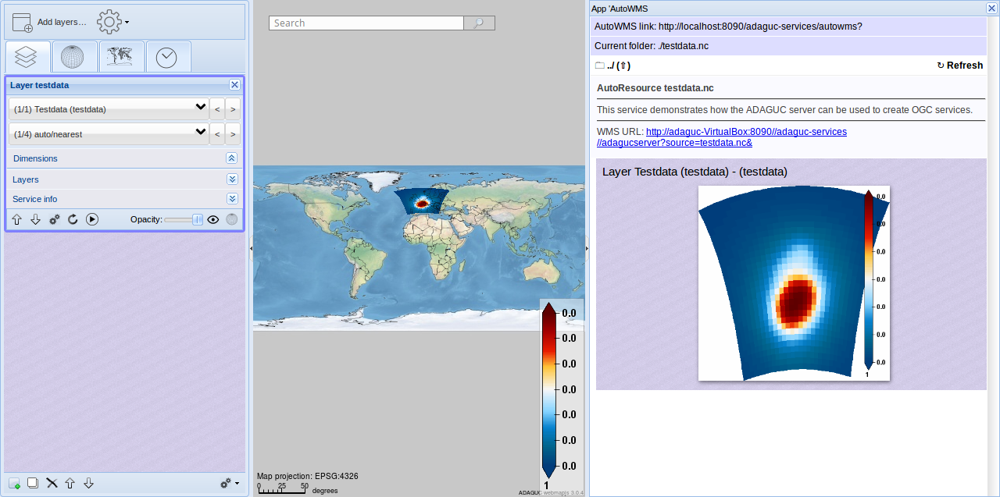

# adaguc-viewer
ADAGUC WMS Viewer for visualizing OGC Web Map Services.

ADAGUC is a geographical information system to visualize netCDF files via the web. The software consists of a server side C++ application and a client side JavaScript application. The software provides several features to access and visualize data over the web, it uses OGC standards for data dissemination. 

## Connect adaguc-viewer to adaguc-server

This viewer is best used with adaguc-server and adaguc-services, please check https://github.com/KNMI/adaguc-server . It can browse and visualize NetCDF automatically.

# Quickstart adaguc-viewer with Docker

There is a docker image available from openearth/adaguc-viewer. It can be used to install and run adaguc-viewer in minutes. 

Follow these steps to get your own adaguc-viewer working:

```
docker pull openearth/adaguc-viewer
docker run -e ADAGUCSERVICES_AUTOWMS="http://localhost:8090/adaguc-services/autowms?" -p 8091:80 --name my-adaguc-viewer -d openearth/adaguc-viewer
```

Or use the following if you have started your adaguc-server with HTTPS:
```
docker run -e ADAGUCSERVICES_AUTOWMS="https://`hostname`:8443/adaguc-services/autowms?" -p 8091:80 --name my-adaguc-viewer -d openearth/adaguc-viewer
```

Visit http://localhost:8091/adaguc-viewer/



Done!
